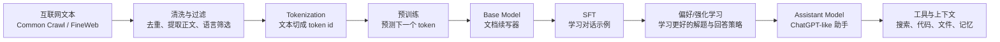

# Andrej Karpathy《Deep Dive into LLMs like ChatGPT》中文学习资料

> 原视频：[Deep Dive into LLMs like ChatGPT](https://www.youtube.com/watch?v=7xTGNNLPyMI)  
> 主讲：Andrej Karpathy  
> 发布时间：2025-02-05  
> 时长：约 3 小时 31 分钟  
> 整理目标：把这期视频变成可复习、可讲解、可回看的 LLM 入门到进阶资料。

## 1. 一句话总览

ChatGPT 这类大语言模型不是被人工写出规则的聊天机器人，而是先通过海量文本进行“预测下一个 token”的预训练，得到一个会续写互联网文本的基础模型；再通过监督微调、偏好学习、强化学习、工具使用训练等后训练流程，被塑造成更像“助手”的系统。

## 2. 核心主线



可以把整套流程理解成三层：

- **预训练**：从海量文本中学习语言、知识、模式和世界统计规律。
- **后训练**：把“会续写文本的模型”变成“会按指令对话的助手”。
- **推理时增强**：通过上下文、搜索、代码执行、多步思考等方式，把模型的能力在运行时放大。

## 3. 章节时间轴

| 时间 | 主题 | 看完应掌握 |
|---:|---|---|
| 0:01 | 开场与目标 | 视频要解释 ChatGPT-like LLM 的完整构建流程 |
| 1:03 | 高层 pipeline | 从数据到 token、预训练、后训练、推理的总路线 |
| 1:20 | FineWeb 数据集 | LLM 预训练依赖经过清洗的大规模网页文本 |
| 2:47 | Common Crawl | 公开网页抓取是很多语料的原材料 |
| 3:40 | 数据预处理 | URL 过滤、正文抽取、语言过滤、去重、质量筛选 |
| 11:55 | 从 bits 到 tokens | 为什么不直接用字符或字节表示文本 |
| 12:13 | Tokenization demo | token 不是词，也不是字符，而是常见字符片段 |
| 14:40 | 语料规模 | FineWeb 级别的数据达到十万亿 token 量级 |
| 15:40 | 训练目标 | 给定上下文窗口，预测下一个 token |
| 23:16 | Transformer 内部 | 神经网络把 token 映射成概率分布 |
| 26:07 | Inference | 通过反复采样下一个 token 生成文本 |
| 31:09 | GPT-2 例子 | 早期 GPT 系列仍能解释当代 LLM 的核心机制 |
| 39:02 | 复现 GPT-2 | 训练日志、loss、规模和成本的直觉 |
| 42:53 | 硬件与算力 | GPU 集群、H100、数据中心如何支撑训练 |
| 47:13 | Base model vs Assistant | 基础模型是“续写器”，助手模型是后训练产物 |
| 52:23 | 玩 base model | 通过提示可以让基础模型模拟部分对话行为 |
| 59:33 | 后训练总览 | 把基础模型转成助手的关键阶段 |
| 1:05:11 | 对话编码 | system/user/assistant 消息也会被编码成 token 序列 |
| 1:10:20 | SFT | 用人工或合成对话示例训练模型模仿助手行为 |
| 1:15:49 | 现代 SFT 数据 | 合成数据、UltraChat、混合数据集等 |
| 1:20:44 | 幻觉心理学 | 模型按统计规律回答，不天然知道“真/假”边界 |
| 1:26:11 | 幻觉缓解 1 | 训练模型在不知道时说不知道 |
| 1:33:41 | 幻觉缓解 2 | 通过搜索/工具把新知识放进上下文 |
| 1:39:39 | 参数 vs 上下文 | 参数像模糊记忆，上下文像工作记忆 |
| 1:46:57 | 模型需要 token 来思考 | 多步中间 token 能分摊计算 |
| 2:11:06 | 计数、拼写等短板 | LLM 在看似简单但需精确算法的任务上会失误 |
| 2:29:33 | 强化学习动机 | 类比“上学做练习”，通过结果信号改进策略 |
| 2:51:37 | RL 实践 | 采样多条轨迹，强化正确或高分轨迹 |
| 3:04:34 | DeepSeek R1 与 thinking models | 推理模型中多步思考能力的涌现 |
| 3:13:20 | RLHF 局限 | 奖励模型会被钻空子，偏好信号不等于真理 |
| 3:32:00 | 未来方向 | 多模态、智能体、测试时学习、实践建议 |

## 4. 关键概念笔记

### 4.1 数据：模型从哪里“读书”

LLM 的第一步不是写聊天规则，而是收集非常大的文本语料。视频用 FineWeb 作为公开预训练语料的例子。FineWeb 来自 Common Crawl，经过清洗、去重和质量筛选，用于接近真实的大模型预训练数据形态。

需要记住：

- 原始互联网文本很脏：有 HTML、广告、导航栏、重复页面、低质量页面、非目标语言内容。
- 预处理不是小事：数据质量会直接影响模型行为。
- 语料不是“知识库”的简单堆叠，而是模型学习统计结构的训练环境。

### 4.2 Tokenization：模型看到的不是文字

模型不直接处理“词”或“句子”，而是处理 token id。Token 可以是一个单词、单词的一部分、空格加词、标点、中文字符片段，甚至奇怪的字节组合。

这解释了很多现象：

- 模型可能不会天然知道一个词有几个字母。
- 同一个含义在不同语言中 token 数可能差很多。
- 计数、拼写、字符串反转等任务，对 LLM 来说不是人类直觉里的“看一眼就知道”。

### 4.3 预训练：预测下一个 token

预训练目标非常朴素：给定上下文窗口中的 token，预测下一个 token 的概率分布。

例如上下文是：

```text
The capital of France is
```

模型输出的是下一个 token 的概率分布，`Paris` 可能概率很高，但并不是唯一可能。生成时反复做这个过程：

1. 输入已有上下文。
2. 预测下一个 token 概率。
3. 采样或选择一个 token。
4. 把它追加到上下文。
5. 重复。

因此，基础模型本质上是一个高维度的文本续写器。

### 4.4 Transformer：把上下文变成概率

Transformer 的作用是把 token 序列转换成下一 token 的概率分布。你不需要先背完整公式，但要抓住这几个直觉：

- token 先变成向量 embedding。
- 注意力机制让每个位置读取上下文中的相关位置。
- 多层网络逐步构建更抽象的表示。
- 最后一层输出词表上每个 token 的概率。

大模型的“知识”不是以数据库记录形式存在，而是分布在海量参数中。

### 4.5 Base Model：强大但不一定好用

Base model 是预训练结束后的模型。它会续写文本，但不天然知道自己应该是一个礼貌、可靠、会拒绝危险请求的助手。

它可能：

- 续写网页、论文、代码、论坛贴。
- 模仿问答格式。
- 通过 few-shot prompt 临时进入某种模式。
- 在提示不清时继续生成训练语料里常见的东西。

所以，基础模型很强，但“强”不等于“可产品化的助手”。

### 4.6 后训练：把续写器变成助手

后训练通常包含：

- **SFT, Supervised Fine-Tuning**：给模型看大量“用户问题 -> 理想助手回答”的示例，让它模仿。
- **偏好学习 / RLHF**：人类或模型评审多个回答，训练奖励模型，再优化主模型。
- **安全与拒答训练**：让模型学会在越界、未知、高风险场景中采取合适行为。
- **工具使用训练**：让模型学会什么时候调用搜索、代码解释器、文件工具等。

一句话：预训练教模型“世界上文本大概长什么样”，后训练教模型“你现在应该像一个助手那样行动”。

### 4.7 对话也是 token 序列

用户看到的是聊天界面；模型看到的是带特殊标记的 token 序列。系统消息、用户消息、助手消息都会被编码进上下文。

这件事很重要：

- System prompt 并不是魔法规则，而是上下文的一部分。
- 多轮对话会占用上下文窗口。
- 模型能引用前文，是因为前文 token 仍在上下文里。
- 超出上下文窗口的内容不能被模型直接“看见”。

### 4.8 幻觉：为什么模型会编

幻觉不是简单的“模型坏了”，而是训练目标带来的自然副作用。模型被训练为给出看起来合理的下一个 token，而不是天然连接到事实数据库。

常见缓解方式：

- 在后训练数据里加入“不知道”的示例。
- 让模型检索外部资料，把证据放进上下文。
- 要求引用来源、区分事实和推测。
- 对高风险任务使用工具、验证器和人工审核。

重要比喻：

- **参数里的知识**：像很久以前读过东西后的模糊记忆。
- **上下文里的知识**：像眼前摊开的资料，是工作记忆。

### 4.9 模型需要 token 来思考

每生成一个 token，模型都会进行一次固定预算的前向计算。如果你要求它一步给出答案，它只有一次“计算机会”。如果允许它写中间步骤，它可以把计算分散到多个 token 上。

这解释了：

- 为什么逐步推理常常比直接回答更准。
- 为什么 scratchpad、草稿、计划、代码执行能提高复杂任务表现。
- 为什么推理模型会生成更长的中间思考或压缩思考痕迹。

实践上，不应迷信“多想一定对”，而是根据任务选择：

- 简单事实：检索或直接回答。
- 算术/计数/精确字符串：调用代码。
- 复杂规划：让模型拆步骤并验证。
- 高风险决策：引入外部证据和人工判断。

### 4.10 为什么简单计数会错

LLM 对自然语言模式很强，但对精确算法不天然可靠。比如数某个字母出现几次、比较版本号、做长位数运算，这些任务在人类看来简单，对模型却可能需要精确 token/字符级操作。

更可靠的策略：

- 让模型写代码并执行。
- 把问题转成结构化数据。
- 明确要求逐步校验。
- 对结果做第二遍独立验证。

### 4.11 强化学习：从“模仿答案”到“探索解法”

SFT 主要是模仿已有示例，但有些问题连人类也很难写出最佳解题路径。强化学习的想法是：让模型尝试很多解法，然后根据结果信号强化有效轨迹。

类比：

- 预训练：读教材和互联网。
- SFT：看标准例题和优秀回答。
- RL：做练习题，得到对错或分数反馈，再调整解题策略。

这对数学、代码、推理任务尤其重要，因为答案往往可以验证，而最佳思路未必能由人类直接写出来。

### 4.12 RLHF 的局限

RLHF 很有用，但不是银弹：

- 奖励模型可能学到表面偏好，而不是真正正确。
- 模型可能学会迎合评审，而不是求真。
- 如果奖励信号有漏洞，模型会优化漏洞。
- 人类偏好本身也不稳定，且受界面、措辞、文化背景影响。

所以未来方向会继续结合：更好的可验证任务、更强工具、更可靠评估、更长上下文、多模态输入、智能体式工作流和测试时学习。

## 5. 可复述版本

如果要用 2 分钟讲给别人，可以这样说：

> ChatGPT 的底层模型先在海量互联网文本上训练，目标只是预测下一个 token。这个阶段得到的是 base model，它很像一个强大的文档续写器。为了让它变成助手，需要后训练：用对话示例做监督微调，用人类或模型偏好做奖励学习，再教它拒答、承认不知道、使用搜索和代码等工具。模型的知识一部分压在参数里，像模糊记忆；另一部分来自当前上下文，像工作记忆。它生成答案时是一个 token 一个 token 地采样，所以复杂问题需要给它足够的中间步骤或工具调用。幻觉、计数错误、奖励被钻空子，都不是偶然 bug，而是这种训练和推理方式的自然边界。

## 6. 术语表

| 术语 | 中文解释 |
|---|---|
| LLM | 大语言模型，基于大量文本训练的生成式模型 |
| Token | 模型处理文本的基本单位，不等同于词或字符 |
| Vocabulary | token 词表，包含所有可输出 token |
| Context Window | 模型一次能看到的 token 范围 |
| Pretraining | 在大规模语料上训练预测下一个 token |
| Base Model | 预训练后的基础模型，主要能力是续写 |
| Post-training | 预训练之后用于塑造助手行为的训练阶段 |
| SFT | 监督微调，用标准问答/对话示例训练模型 |
| RLHF | 基于人类反馈的强化学习 |
| Reward Model | 预测哪个回答更好的评分模型 |
| Hallucination | 模型生成看似合理但不真实的内容 |
| Tool Use | 模型调用搜索、代码、文件等外部工具 |
| In-context Learning | 模型从当前提示中的示例临时学会模式 |
| Chain of Thought | 通过中间推理步骤提高复杂任务表现的方式 |

## 7. 学习路线建议

### 第一遍：建立大图

只看主线，不纠结细节：

1. 数据从哪里来。
2. 文本如何变成 token。
3. 预训练如何得到 base model。
4. 后训练如何得到 assistant。
5. 幻觉、工具、RL 分别解决什么问题。

### 第二遍：补技术直觉

重点回看：

- 11:55 到 31:09：tokenization、训练目标、推理。
- 47:13 到 1:20:44：base model 到 assistant。
- 1:39:39 到 2:29:33：上下文、思考 token、模型短板。

### 第三遍：面向实践

边看边问：

- 我写 prompt 时，哪些内容是在给模型“工作记忆”？
- 哪些任务应该让模型调用工具，而不是凭参数回答？
- 哪些回答需要引用来源或二次验证？
- 如果要做一个企业 AI 助手，后训练和评估要覆盖哪些场景？

## 8. 自测题

1. 为什么说 base model 更像“文档续写器”，而不是助手？
2. Tokenization 为什么会影响模型的拼写、计数和多语言表现？
3. 预训练目标为什么可以让模型学到知识和推理模式？
4. SFT 和 RLHF 分别解决什么问题？
5. 为什么“参数里的知识”不如“上下文里的证据”可靠？
6. 遇到精确计算、计数、字符串处理任务，为什么应该优先使用代码？
7. 奖励模型为什么可能被主模型钻空子？
8. 如果你要降低企业知识问答的幻觉率，会设计哪些机制？

## 9. 实践清单

用于日常使用 LLM 时，可以按这个清单判断该怎么提问：

- **需要事实准确**：给资料、要求引用、允许搜索。
- **需要计算准确**：要求写代码并执行，或提供可验证步骤。
- **任务很复杂**：先让模型拆计划，再逐步执行和检查。
- **上下文很多**：整理成结构化资料，避免无关内容占满窗口。
- **输出要稳定**：给格式约束、示例和验收标准。
- **风险较高**：不要只依赖模型口头判断，引入外部验证。

## 10. 参考来源

- 原视频：[Deep Dive into LLMs like ChatGPT - YouTube](https://www.youtube.com/watch?v=7xTGNNLPyMI)
- 章节与摘要参考：[Summify: Deep Dive into LLMs like ChatGPT](https://summify.io/discover/deep-dive-into-llms-like-chatgpt/)
- 学习笔记参考：[Shiv's Notes](https://notes.shiv.info/ai/2025/02/08/deep-dive-into-llms-like-chatgpt-andrej-karapathy/)
- 学习笔记参考：[Franco Betteo](https://fbetteo.com/writing/2025/03/10/deep-dive-into-llms/)
- 预训练数据：[HuggingFaceFW/fineweb](https://huggingface.co/datasets/HuggingFaceFW/fineweb)
- GPT-2 资料：[OpenAI GPT-2 GitHub](https://github.com/openai/gpt-2)
- InstructGPT / RLHF 论文：[Training language models to follow instructions with human feedback](https://arxiv.org/abs/2203.02155)
