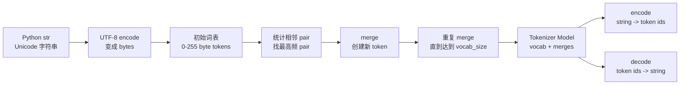

# Andrej Karpathy《Let's build the GPT Tokenizer》中文学习资料

> 原视频：[Let's build the GPT Tokenizer](https://www.youtube.com/watch?v=zduSFxRajkE)  
> 主讲：Andrej Karpathy  
> 发布时间：2024-02-20  
> 时长：约 2 小时 14 分钟  
> 配套代码：[karpathy/minbpe](https://github.com/karpathy/minbpe)  
> 整理目标：理解 GPT tokenizer 为什么重要，并能从零实现一个 byte-level BPE tokenizer。

## 1. 一句话总览

Tokenizer 是 LLM 的“文字入口”：它把人类字符串编码成模型能处理的 token id，也把模型输出的 token id 解码回字符串。GPT 系列常用 byte-level BPE，把 UTF-8 字节作为基础词表，再不断合并高频相邻字节/片段，从而用更短的 token 序列表示文本。

## 2. 为什么 Tokenizer 很重要

很多 LLM 的怪异行为都和 tokenizer 有关：

- 同一句话在不同语言中 token 数差异很大，影响成本、上下文长度和模型能力。
- 模型不直接“看见”字符，所以拼写、数字、反转字符串、计数字母等任务会变难。
- 空格、缩进、换行、大小写、emoji、中文、代码都会被切成不同 token 结构。
- 特殊 token 会定义文档边界、对话边界、工具调用、fill-in-the-middle 等模型协议。
- tokenizer 是模型训练前的独立组件，一旦模型训练完成，通常不能随便更换。

一句话：Transformer 处理的是 token 序列，不是原始文本。Tokenizer 的设计会决定模型“看世界”的颗粒度。

## 3. 核心主线



## 4. 章节时间轴

| 时间 | 主题 | 看完应掌握 |
|---:|---|---|
| 0:00 | Tokenization 为什么重要 | tokenizer 是 LLM 中隐藏但核心的组件 |
| 0:27 | 回顾字符级 tokenizer | naive char-level tokenizer 简单但不够实用 |
| 2:51 | GPT-2 / LLaMA 中的 token | token 是 LLM 的基本输入输出单位 |
| 4:21 | tokenization 引发的问题 | 拼写、数字、空格、多语言等问题的根源 |
| 5:57 | tiktokenizer demo | 可视化 GPT-2/GPT-4 tokenizer 的差异 |
| 14:57 | Unicode 与 UTF-8 | 为什么要从 bytes 而不是 Unicode code point 出发 |
| 23:50 | BPE 高层思路 | 反复合并最高频相邻 pair |
| 27:03 | 实现 get_stats | 统计相邻 token pair 的频次 |
| 35:01 | 训练 merges | 迭代合并、扩大词表、观察压缩率 |
| 39:24 | tokenizer 与 LLM 分离 | tokenizer 是模型外部的预处理/后处理阶段 |
| 42:48 | decode | token ids -> bytes -> UTF-8 string |
| 48:25 | encode | string -> bytes -> token ids，按 merge 顺序压缩 |
| 55:11 | 测试和边界情况 | round-trip、非法 UTF-8、错误处理 |
| 56:58 | BPE 复盘 | 从 toy tokenizer 过渡到生产 tokenizer |
| 1:11:40 | GPT-2 encoder.py | OpenAI GPT-2 tokenizer 的实现结构 |
| 1:12:28 | Regex chunking | 用正则限制哪些边界允许 merge |
| 1:15:08 | GPT-2 bpe 函数 | 生产实现中的缓存、rank、merge 细节 |
| 1:18:31 | Special tokens | endoftext、对话、FIM 等特殊 token 的意义 |
| 1:25:34 | minbpe 练习 | 构建类似 GPT-4 的 tokenizer |
| 1:43:30 | vocab size 取舍 | 词表大小、embedding 成本、上下文密度的权衡 |
| 1:48:27 | 添加 token 与 prompt compression | 新 token、gist token、模型手术 |
| 1:49:59 | 文本之外的 token | 图像、音频、视频、soft tokens、多模态 |
| 2:04:57 | 实战坑点 | 数字、尾随空格、罕见 token、SolidGoldMagikarp |
| 2:10:21 | 总结建议 | 使用成熟 tokenizer，理解其边界 |

## 5. Tokenizer 的两个方向

### 5.1 Encode

把字符串变成 token id：

```text
"hello world" -> [15339, 1917]
```

一般路径：

1. Python 字符串是 Unicode 文本。
2. 用 UTF-8 编码成 bytes。
3. 每个 byte 先对应一个 0-255 的 token。
4. 根据训练好的 merge 表，把高频相邻 pair 合并成更大的 token。
5. 输出 token id 列表。

### 5.2 Decode

把 token id 变回字符串：

```text
[15339, 1917] -> "hello world"
```

一般路径：

1. 每个 token id 查 vocab，得到 bytes 片段。
2. 拼接所有 bytes。
3. 用 UTF-8 解码成字符串。
4. 对非法 UTF-8 序列要决定是报错还是替换。

需要注意：合法的 token id 序列不一定总能严格解码成合法 UTF-8 字符串，生产系统通常需要容错策略。

## 6. Unicode、UTF-8 与 Bytes

### 6.1 为什么不直接用 Unicode code point

Unicode 字符空间很大，而且还在增长。如果直接把每个 code point 当作 token，会遇到：

- 词表巨大。
- 稀有字符 embedding 训练不足。
- 多语言和 emoji 组合复杂。
- 不同规范化形式可能看起来一样但编码不同。

### 6.2 为什么用 UTF-8 bytes 起步

UTF-8 的优点：

- 所有文本都能表示。
- 英文 ASCII 兼容，常见英文字符只占 1 byte。
- 每个 byte 只有 256 种，初始词表稳定。
- 不需要 unknown token，因为任意字符串都可先转成 bytes。

缺点是：纯 byte 序列太长，所以需要 BPE 把常见片段合并起来。

## 7. BPE 算法直觉

Byte Pair Encoding 的训练过程：

1. 把训练文本转成 UTF-8 bytes。
2. 初始化 token 序列，每个 byte 是一个 token。
3. 统计所有相邻 token pair 的出现次数。
4. 找出最高频 pair。
5. 给这个 pair 分配一个新的 token id。
6. 把文本中所有这个 pair 替换成新 token。
7. 重复，直到词表达到目标大小。

比如 toy 文本：

```text
aaabdaaabac
```

如果频繁出现 `aa`、`ab`、`aaab`，BPE 会逐步把它们合并为新 token。最后，常见片段用一个 token 表示，序列长度变短。

## 8. 最小实现草图

### 8.1 统计 pair

```python
def get_stats(ids):
    counts = {}
    for pair in zip(ids, ids[1:]):
        counts[pair] = counts.get(pair, 0) + 1
    return counts
```

### 8.2 合并 pair

```python
def merge(ids, pair, idx):
    newids = []
    i = 0
    while i < len(ids):
        if i < len(ids) - 1 and (ids[i], ids[i + 1]) == pair:
            newids.append(idx)
            i += 2
        else:
            newids.append(ids[i])
            i += 1
    return newids
```

### 8.3 训练 tokenizer

```python
def train(text, vocab_size):
    tokens = list(text.encode("utf-8"))
    merges = {}
    num_merges = vocab_size - 256

    for i in range(num_merges):
        stats = get_stats(tokens)
        pair = max(stats, key=stats.get)
        idx = 256 + i
        tokens = merge(tokens, pair, idx)
        merges[pair] = idx

    return merges
```

这就是 byte-level BPE 的核心。生产版本会更复杂，但骨架就是统计、合并、记录 merge 表。

## 9. Vocab 与 Merges

训练完成后，你需要两个核心对象：

- **vocab**：`token_id -> bytes`
- **merges**：`(token_id_a, token_id_b) -> new_token_id`

初始 vocab：

```text
0   -> b"\x00"
1   -> b"\x01"
...
97  -> b"a"
98  -> b"b"
...
255 -> b"\xff"
```

每次 merge 会新增一个 token：

```text
(97, 97) -> 256      # b"a" + b"a" = b"aa"
(256, 98) -> 257     # b"aa" + b"b" = b"aab"
```

decode 依赖 vocab，encode 依赖 merges 的优先顺序。

## 10. Encode 的关键：按 rank 合并

训练时越早出现的 merge，rank 越高。编码新文本时，不能简单地把所有可合并 pair 一次性替换，而是要每次选择当前文本中 rank 最靠前的 pair 进行合并。

直觉：

- 训练阶段记录了 merge 顺序。
- encode 阶段必须复现这个顺序。
- 否则同一个字符串会得到不同 token 序列。

这也是生产 tokenizer 中 `bpe_ranks`、缓存和优先级逻辑很重要的原因。

## 11. Regex Chunking：为什么生产 tokenizer 先切块

如果只用 BPE，模型可能把任何相邻字符都合并，包括跨越不希望合并的边界。GPT-2/GPT-4 tokenizer 会先用正则把文本切成 chunk，再在每个 chunk 内运行 BPE。

这样做可以控制：

- 字母、数字、标点、空白之间的边界。
- 缩写和大小写的处理。
- 是否允许跨空格合并。
- 代码缩进和换行的压缩方式。

这解释了为什么 GPT-4 tokenizer 相比 GPT-2 在代码、连续空格、多语言上更高效：正则和词表都经过了更现代的设计。

## 12. Special Tokens

Special tokens 不是普通文本片段，而是模型协议的一部分，例如：

- `<|endoftext|>`：文档结束。
- beginning/end of message：对话消息边界。
- system/user/assistant 标记：聊天角色结构。
- prefix/middle/suffix：fill-in-the-middle 代码补全。
- tool call 相关标记：工具调用与返回结果的结构。

关键点：

- special token 要有固定 id。
- 模型 embedding 表要包含这些 id。
- 训练数据中要让模型见过这些 token 的语义。
- 不能随意新增 special token 后就期待旧模型理解。

## 13. Vocab Size 的权衡

词表越大：

- 常见片段越可能被单 token 表示。
- 同样上下文窗口能容纳更多原始文本。
- 多语言、代码、常见短语可能更省 token。

但也会带来：

- embedding 表和输出分类头更大。
- 稀有 token 训练不足。
- tokenizer 训练和维护复杂度上升。
- 给已有模型更换 tokenizer 的成本很高。

所以 vocab size 不是越大越好，而是模型规模、训练数据、目标语言、上下文长度和部署成本之间的工程取舍。

## 14. 常见坑

### 14.1 拼写和计数

模型看到的是 token，不是字符。`strawberry` 可能被切成多个片段，模型不天然有逐字符视图，所以数 `r` 的个数会出错。

### 14.2 数字

数字可能按不同长度切分，例如 `123456` 可能不是六个独立数字 token。数学和比较任务最好交给代码或结构化解析。

### 14.3 尾随空格

很多 token 会把前导空格或尾随空格编码进去。`"hello"` 和 `" hello"` 往往是不同 token。

### 14.4 多语言

英语通常压缩率更好，部分语言可能 token 更密集，导致：

- 同样上下文能放入的内容更少。
- 训练样本效率不同。
- API 成本和延迟更高。

### 14.5 罕见 token

如果某些 token 在训练中极少出现，它们的 embedding 可能训练不足。历史上曾出现过罕见 token 导致模型异常行为的案例。

## 15. 与 GPT-2、GPT-4、LLaMA 的关系

- **GPT-2**：使用 byte-level BPE，约 50k 词表，是理解 GPT tokenizer 的经典实现。
- **GPT-4 / tiktoken**：使用更现代的 BPE tokenizer，更大的词表，更关注代码、空格、多语言效率。
- **LLaMA / SentencePiece**：常见于开源模型生态，设计不同，常涉及 Unigram 或 BPE 变体。
- **minbpe**：Karpathy 的教学实现，用最少代码展示 BPE、regex tokenizer、special token 等核心机制。

## 16. 可复述版本

如果要用 2 分钟讲给别人，可以这样说：

> Tokenizer 负责把字符串变成 LLM 能处理的 token id。GPT tokenizer 通常从 UTF-8 bytes 出发，因为任意文本都能表示，且初始词表只有 256 个 byte。为了避免 byte 序列太长，BPE 会反复统计最常见的相邻 token pair，把它们合并成新 token，最终得到 vocab 和 merges。编码时按 merge rank 把文本压缩成 token，解码时把 token 查回 bytes 再转成 UTF-8 字符串。生产 tokenizer 还会用 regex 先切块，并加入 special tokens 来表示文档、对话、工具调用等协议。很多 LLM 的拼写、计数、多语言成本、代码缩进问题，本质上都和 tokenizer 的切分方式有关。

## 17. 学习路线建议

### 第一遍：建立直觉

重点看：

- 0:00 到 14:57：为什么 tokenizer 重要。
- 14:57 到 23:50：Unicode、UTF-8、bytes。
- 23:50 到 39:24：BPE 的核心训练过程。

### 第二遍：跟着实现

边看边写：

- `get_stats(ids)`
- `merge(ids, pair, idx)`
- `train(text, vocab_size)`
- `decode(ids)`
- `encode(text)`

目标不是一次写出生产级 tokenizer，而是亲手理解“统计 pair -> 合并 -> 记录 merges -> encode/decode”的闭环。

### 第三遍：看生产差异

重点回看：

- 1:11:40 到 1:18:31：GPT-2 encoder.py。
- 1:18:31 到 1:25:34：special tokens。
- 1:25:34 到 1:43:30：minbpe 与 GPT-4-like tokenizer。
- 2:04:57 到结尾：真实坑点。

## 18. 自测题

1. 为什么 GPT tokenizer 通常从 UTF-8 bytes 而不是 Unicode code point 起步？
2. BPE 的 `vocab` 和 `merges` 分别存什么？
3. 为什么 encode 时要按 merge rank 合并？
4. 为什么 tokenizer 是 LLM 外部的独立阶段？
5. Regex chunking 解决了什么问题？
6. special token 和普通 token 的区别是什么？
7. vocab size 变大会带来哪些收益和成本？
8. 为什么模型会在拼写、数字、计数任务上犯错？
9. 为什么给已训练模型随便换 tokenizer 通常不可行？
10. 如何验证一个 tokenizer 的 encode/decode 是否可靠？

## 19. 实践清单

做 tokenizer 或调试 token 问题时，可以按这个清单走：

- 用官方 tokenizer 计算目标模型的 token 数，不要自己估算。
- 检查空格、换行、缩进是否被按预期切分。
- 对多语言文本单独评估 token 密度。
- 对代码任务检查缩进和连续空格的 token 表示。
- 对特殊协议使用模型官方 special tokens。
- 自己训练 tokenizer 时保留训练语料、vocab、merges、regex pattern 和版本号。
- 做 round-trip 测试：`decode(encode(text)) == text`。
- 对非法 UTF-8 和未知 special token 设计明确策略。

## 20. 参考来源

- 原视频：[Let's build the GPT Tokenizer - YouTube](https://www.youtube.com/watch?v=zduSFxRajkE)
- 视频摘要与章节：[Summify: Let's build the GPT Tokenizer](https://summify.io/discover/let-s-build-the-gpt-tokenizer)
- 课程目录参考：[Class Central: Building the GPT Tokenizer](https://www.classcentral.com/course/youtube-let-s-build-the-gpt-tokenizer-283690)
- 配套代码：[karpathy/minbpe](https://github.com/karpathy/minbpe)
- OpenAI tokenizer 库：[openai/tiktoken](https://github.com/openai/tiktoken)
- GPT-2 代码：[openai/gpt-2](https://github.com/openai/gpt-2)
