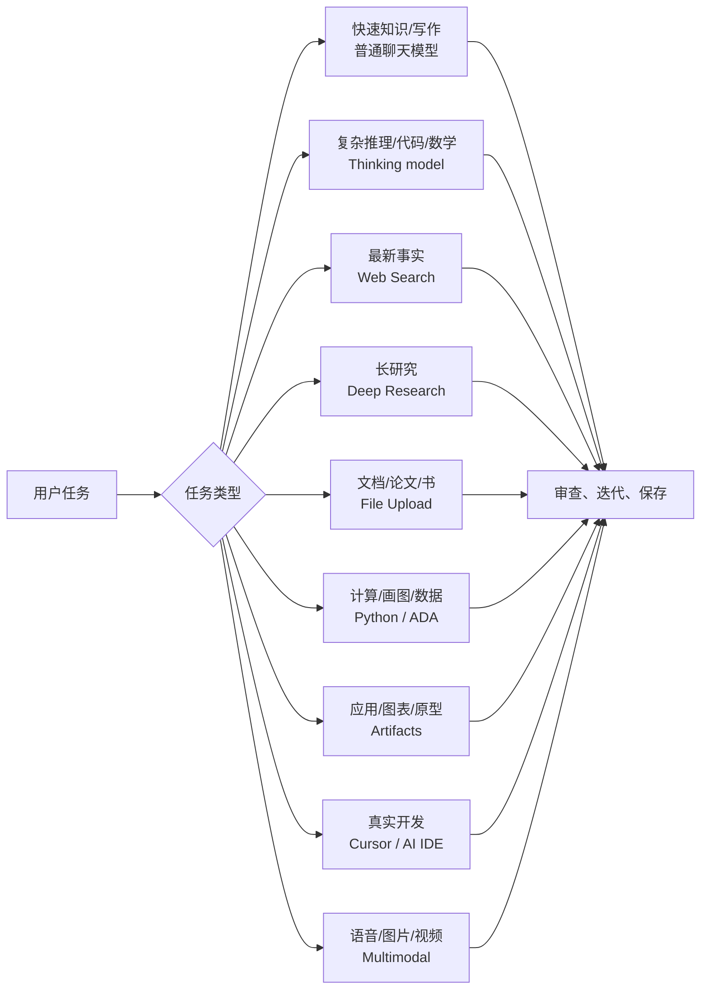

# Andrej Karpathy《How I use LLMs》中文学习资料

> 原视频：[How I use LLMs](https://www.youtube.com/watch?v=EWvNQjAaOHw)  
> 主讲：Andrej Karpathy  
> 发布时间：2025-02-27  
> 时长：约 2 小时 12 分钟  
> 整理目标：把这期视频整理成一份 LLM 日常使用、研究、写作、编程和多模态工作流手册。  
> 注意：视频中的具体产品、模型名、价格和功能是 2025 年初的快照，实际使用时应以当前产品页面为准。

## 1. 一句话总览

这期视频的核心不是“LLM 怎么训练”，而是“普通人和专业工作者如何把 LLM 当作认知工具来用”：根据任务选择模型，管理上下文，使用搜索、深度研究、文件上传、代码解释器、Artifacts、AI 编程工具、多模态输入输出、记忆和自定义 GPT，把 LLM 从聊天框扩展成个人工作台。

## 2. 核心主线



一句话原则：不要把 LLM 只当成一个会聊天的网页；把它当成一个能接工具、读材料、写代码、看图、听声音、生成界面的交互层。

## 3. 章节时间轴

| 时间 | 主题 | 看完应掌握 |
|---:|---|---|
| 0:00 | 开场与目标 | 这是面向普通用户的 LLM 使用指南 |
| 2:52 | Chat UI、tokens、上下文窗口 | 聊天记录是模型的工作记忆，越长越贵也越容易跑偏 |
| 7:59 | 模型内部、预训练、后训练、知识截止 | 模型参数像压缩记忆，不能天然知道最新信息 |
| 13:16 | 实用知识查询 | 用 LLM 快速查询常识，但高风险事实要验证 |
| 16:24 | 对话管理 | 主题切换时开新聊天，重要上下文要显式保留 |
| 18:05 | 模型与价格层级 | 选择模型时权衡速度、价格、能力和使用限制 |
| 22:56 | Thinking models | 难题用会“思考”的推理模型，简单题不要过度使用 |
| 25:32 | 修 gradient check bug demo | 推理模型适合多步调试与复杂代码问题 |
| 31:02 | 工具使用总览 | 工具让模型突破参数记忆、心算和单纯文本输出的限制 |
| 39:06 | Web search | 新信息、实时信息、事实核查应使用搜索 |
| 42:05 | Deep research | 长时间、多来源研究适合交给深度研究模式 |
| 43:42 | AKG 与补剂研究 demo | 研究任务要看引用、证据质量和结论边界 |
| 51:41 | 文件上传 | 把论文、书、合同、代码加入上下文再提问 |
| 59:01 | Python 工具 | 计算、数据处理、图表、验证应调用代码 |
| 1:04:36 | Advanced Data Analysis | 让模型写 Python 分析数据，但要检查图表和假设 |
| 1:09:18 | Claude Artifacts | 让模型生成可交互网页、图表、Mermaid 可视化 |
| 1:14:29 | Cursor 与 vibe coding | 用 AI IDE 把自然语言转成多文件代码改动 |
| 1:22:30 | 多模态总览 | 输入输出不再局限于文本 |
| 1:29:13 | Advanced voice | 原生音频模型能听语调、停顿和情绪 |
| 1:37:17 | NotebookLM | 从资料生成播客式讲解，适合通勤学习 |
| 1:41:54 | 图像输入与 OCR | 让模型看截图、表格、营养标签、检查报告、梗图 |
| 1:49:15 | 视频/摄像头输入 | 指着现实对象提问，模型可结合画面回答 |
| 1:53:31 | Memory 与 Custom Instructions | 把长期偏好和通用约束保存下来 |
| 1:58:43 | Custom GPTs | 把重复工作流封装成可复用助手 |
| 2:06:31 | 总结 | 多试工具，匹配任务，审查输出，形成个人工作流 |

## 4. 关键概念笔记

### 4.1 聊天界面背后是 token 流

你看到的是聊天气泡，模型看到的是一串 token。系统提示、用户消息、助手回答、上传文件内容、工具结果都会被拼进上下文窗口。

使用建议：

- 一个主题一个聊天，避免上下文混杂。
- 长对话变慢、变贵，也可能引入无关干扰。
- 重要背景要显式放进当前对话，不要假设模型“知道你刚才在想什么”。
- 对复杂任务，先让模型复述目标和约束，再开始执行。

### 4.2 参数知识 vs 实时知识

LLM 的参数知识来自训练阶段，像一个压缩过的互联网记忆。它可以回答大量常识问题，但对新事件、产品变更、价格、法律、医学、金融等高时效或高风险内容，必须使用搜索或外部资料。

可以这样判断：

- **稳定常识**：可以直接问。
- **最近变化**：使用搜索。
- **需要证据**：要求引用来源。
- **高风险决策**：把 LLM 当助手，不当最终权威。

### 4.3 模型选择：快模型、强模型、思考模型

不同模型适合不同任务：

- 快速模型：适合改写、翻译、总结、日常问答。
- 强通用模型：适合复杂写作、代码解释、跨领域讨论。
- Thinking model：适合数学、逻辑、调试、多步规划、难题攻关。

经验规则：

- 简单问题不要用最慢最贵的模式。
- 难题不要急着让快模型“一步给答案”。
- 重要结论可以让多个模型交叉检查。

### 4.4 Thinking models：什么时候值得等

Thinking model 的价值在于它会在回答前花更多推理预算，常见收益场景包括：

- 找代码 bug。
- 复杂数学或逻辑题。
- 多约束规划。
- 需要权衡多种方案的技术决策。
- 不容易通过搜索直接得到答案的问题。

但它也有成本：

- 更慢。
- 可能更贵。
- 简单任务上收益不明显。
- 仍然需要验证，不是“永远正确”。

### 4.5 工具使用：LLM 的能力扩展器

LLM 本身擅长语言和模式，但不擅长所有事情。工具让它补上短板：

- 搜索：获取最新信息。
- 深度研究：读取多来源并综合。
- 文件上传：读取用户提供的上下文。
- Python：计算、画图、数据处理、验证。
- Artifacts：生成可交互 UI 或图表。
- AI IDE：直接编辑代码库。
- 多模态工具：处理语音、图像、视频。

好用的 LLM 工作流通常不是“问一句拿答案”，而是“模型 + 工具 + 人类审查”的循环。

### 4.6 Web Search：新信息必须接地

需要搜索的典型问题：

- 今天是否开市、某公司 CEO 是谁、产品是否涨价。
- 新剧什么时候上线。
- 某库最新 API 怎么用。
- 法规、政策、比赛、新闻、版本更新。

使用技巧：

- 明确要求模型列出来源。
- 让模型区分“来源说了什么”和“它自己的推断”。
- 对争议信息要求多个来源交叉验证。
- 不要只看摘要，重要内容要打开原文。

### 4.7 Deep Research：把搜索变成研究任务

普通搜索适合快问快答，Deep Research 适合需要多步查证和综合的主题，例如：

- 比较多个产品或服务。
- 研究健康补剂、技术选型、市场格局。
- 阅读多个论文或博客后给出路线图。
- 准备一份带引用的资料综述。

好的研究提示应包含：

- 研究问题。
- 背景和目标读者。
- 需要覆盖的维度。
- 希望输出的结构。
- 对引用和不确定性的要求。

### 4.8 文件上传：把资料放进工作记忆

上传文件等于把外部资料放入模型上下文。适合：

- 读论文：总结贡献、方法、实验、局限。
- 读书：按章节提炼观点，生成复习卡片。
- 读合同：找关键条款和风险点。
- 读代码：解释模块、找 bug、生成测试。
- 读表格：做数据清洗、分析和可视化。

建议先让模型做“资料地图”：

1. 这份文件是什么。
2. 主要章节/字段有哪些。
3. 关键结论是什么。
4. 哪些地方不确定或需要人工检查。

### 4.9 Python / Advanced Data Analysis：别让模型心算

LLM 容易在精确计算上犯错。只要涉及数字、表格、统计、图表、文件转换，优先让模型使用代码。

适合交给 Python 的任务：

- 算术、统计、聚合。
- CSV/Excel 数据分析。
- 绘图和可视化。
- 字符串处理、计数、正则。
- 模拟和枚举。
- 验证模型自己的答案。

使用时要看两件事：

- 代码是否真的执行了。
- 输出是否和问题一致，图表标签、单位、轴范围是否正确。

### 4.10 Claude Artifacts：让回答变成可交互对象

Artifacts 的核心价值是把“文本回答”变成“可运行/可看的对象”：

- 小网页。
- 可交互计算器。
- 数据图表。
- Mermaid 架构图。
- 学习卡片应用。
- 原型 UI。

它适合探索和演示，不等于生产代码。真正上线前仍要做代码审查、测试、安全处理和部署工程。

### 4.11 Cursor 与 Vibe Coding

Karpathy 用 Cursor 展示了 AI 编程的新工作流：开发者给出目标，模型读取代码库，修改多个文件，安装依赖，运行或建议测试。

实用原则：

- 给清楚目标和验收标准。
- 让模型先读相关文件，再动手。
- 小步提交，小步审查。
- 对不熟悉的改动要求解释。
- 测试失败时把错误日志原样交给模型。
- 保留人类对架构、边界和安全的判断。

“Vibe coding”不是完全放弃工程能力，而是把体力活交给模型，人类负责方向、审查和取舍。

### 4.12 多模态：从聊天框到现实接口

多模态让 LLM 不只处理文本：

- **语音输入**：适合头脑风暴、走路时记录想法、练口语。
- **语音输出**：适合陪练、解释、复述和通勤学习。
- **图像输入**：适合 OCR、看截图、读图表、看营养标签、检查 UI。
- **图像输出**：适合视觉草图、营销图、插画、原型探索。
- **视频/摄像头输入**：适合现场问答、物体识别、操作指导。
- **视频输出**：适合概念短片、故事板和动态视觉探索。

多模态的关键变化是：很多任务不再需要先把现实世界手动转成文字。

### 4.13 Memory 与 Custom Instructions

Memory 保存跨对话的个人信息和偏好，Custom Instructions 保存全局行为偏好。

适合保存：

- 你的职业背景。
- 常用技术栈。
- 写作风格偏好。
- 学习目标。
- 常见输出格式。

不适合随便保存：

- 临时任务细节。
- 敏感隐私。
- 未来可能误导模型的过期偏好。

建议定期检查和清理记忆。长期记忆越多，不一定越好。

### 4.14 Custom GPTs：把重复提示产品化

如果你反复做同一种任务，就可以把提示、示例、输出格式、知识文件封装成 Custom GPT。

适合封装：

- 语言学习词汇提取器。
- 代码 review 助手。
- 周报整理助手。
- 论文阅读助手。
- 客服回复草稿助手。
- 固定格式的数据转换器。

关键不是写一段很长的说明，而是给出高质量示例，也就是 few-shot prompting。

## 5. 任务到工具的匹配表

| 任务 | 推荐方式 | 注意事项 |
|---|---|---|
| 快速解释概念 | 普通聊天模型 | 要求类比和例子 |
| 最新事实查询 | Web Search | 要求引用来源 |
| 多来源研究 | Deep Research | 检查引用和结论边界 |
| 论文/合同/书籍 | 文件上传 | 先生成资料地图 |
| 数字计算/图表 | Python / ADA | 检查代码和单位 |
| 复杂代码 bug | Thinking model + AI IDE | 小步审查，不盲信 patch |
| 生成交互原型 | Claude Artifacts | 适合探索，不等于生产 |
| 头脑风暴 | 语音输入/普通模型 | 后续整理成结构化笔记 |
| 读截图/收据/标签 | 图像输入/OCR | 重要数字二次确认 |
| 长期偏好 | Memory / Custom Instructions | 定期清理 |
| 重复工作流 | Custom GPT | 用示例约束输出 |

## 6. 可复述版本

如果要用 2 分钟讲给别人，可以这样说：

> Karpathy 这期视频讲的是 LLM 的实际使用方法。核心观点是：不要只把 ChatGPT 当聊天框，而要根据任务选择模型和工具。普通问题用快模型，复杂推理和代码调试用 thinking model，最新信息用搜索，长研究用 Deep Research，文件和论文直接上传，计算和数据分析交给 Python，原型和图表可以用 Artifacts，真实编程可以用 Cursor。LLM 的上下文窗口是工作记忆，所以要管理聊天、保留重要资料、主题变化时开新会话。多模态能力让模型可以听声音、看图片、读视频，Memory、Custom Instructions 和 Custom GPTs 则把临时对话变成长期个人工作流。最终方法是：匹配工具、给足上下文、让模型执行、由人类审查和迭代。

## 7. 我的实用提示模板

### 7.1 普通知识问题

```text
请用面向 [目标读者] 的方式解释 [主题]。
要求：
1. 先给一句话定义。
2. 再给一个直觉类比。
3. 最后列出 3 个常见误解。
如果涉及不确定或可能过时的信息，请明确标注。
```

### 7.2 搜索型问题

```text
请搜索并回答：[问题]。
要求：
1. 优先使用官方或一手来源。
2. 给出来源链接。
3. 区分事实、推断和不确定点。
4. 如果不同来源冲突，请列出冲突点。
```

### 7.3 文件阅读

```text
我会上传一份文件。请先不要急着总结，先输出：
1. 文件类型和主要结构。
2. 每个章节/部分的作用。
3. 你认为我最应该关注的 5 个问题。
然后等我指定方向再深入分析。
```

### 7.4 数据分析

```text
请用 Python 分析这份数据。
要求：
1. 先检查字段、缺失值和异常值。
2. 再回答我的问题：[问题]。
3. 所有计算都用代码完成。
4. 图表要标注标题、坐标轴和单位。
5. 最后列出分析限制。
```

### 7.5 代码任务

```text
请先阅读相关文件，理解现有模式，然后实现：[目标]。
验收标准：
1. 不改无关文件。
2. 保持现有代码风格。
3. 添加或更新必要测试。
4. 运行相关测试并说明结果。
5. 修改前先给出简短计划。
```

## 8. 常见误区

- **误区 1：一个模型解决所有问题。**  
  更好的方式是根据任务选择模型、搜索、代码、文件、图像或 AI IDE。

- **误区 2：长对话一定更聪明。**  
  长上下文可能带来干扰。主题变化时开新聊天，重要信息重新给清楚。

- **误区 3：LLM 能记住所有最新事实。**  
  参数知识有截止日期，实时问题需要搜索。

- **误区 4：推理模型永远更好。**  
  它适合难题，但简单任务会浪费时间和成本。

- **误区 5：生成代码就等于完成开发。**  
  代码仍需要测试、审查、理解和维护。

- **误区 6：Memory 越多越个性化。**  
  错误或过期记忆会污染后续对话。

## 9. 自测题

1. 为什么主题变化时应该开新聊天？
2. 参数知识和上下文知识有什么区别？
3. 哪些任务适合使用 thinking model？
4. 为什么最新事实查询要用 web search？
5. Deep Research 和普通搜索的区别是什么？
6. 文件上传后，第一步为什么最好先做“资料地图”？
7. 为什么计算和图表任务应该交给 Python？
8. Artifacts 适合什么场景，不适合什么场景？
9. Vibe coding 中人类开发者仍然负责什么？
10. Memory、Custom Instructions、Custom GPTs 三者分别解决什么问题？

## 10. 实践清单

日常使用 LLM 前，先问自己：

- 这个问题是否需要最新信息？
- 是否需要引用来源？
- 是否有文件、图片、代码或数据应该上传？
- 是否涉及计算，应该让模型执行代码？
- 是否足够复杂，值得用 thinking model？
- 是否是重复任务，值得做成 Custom GPT？
- 是否需要保存长期偏好到 Memory 或 Custom Instructions？
- 输出是否需要人工审查、测试或二次验证？

## 11. 与前两篇资料的关系

| 资料 | 重点 | 你学到什么 |
|---|---|---|
| Deep Dive into LLMs like ChatGPT | 原理总览 | LLM 怎么训练、为什么会幻觉、为什么需要工具 |
| Let's build the GPT Tokenizer | Tokenizer | 文本如何变成 token，为什么计数/拼写会怪 |
| How I use LLMs | 使用工作流 | 如何把 LLM、工具、多模态和个人偏好组合成生产力系统 |

三篇连起来看：

1. 先理解 LLM 的认知边界。
2. 再理解 tokenization 的输入边界。
3. 最后学习如何在真实任务中规避边界、放大能力。

## 12. 参考来源

- 原视频：[How I use LLMs - YouTube](https://www.youtube.com/watch?v=EWvNQjAaOHw)
- 章节与摘要参考：[Summify: How I use LLMs](https://summify.io/discover/how-i-use-llms/)
- 摘要参考：[Glasp: How to Effectively Use Large Language Models Like ChatGPT](https://glasp.co/youtube/p/how-i-use-llms)
- 中英笔记参考：[Alan Hou: Notes: How I Use LLMs](https://alanhou.org/blog/karpathy-how-i-use-llms/)
